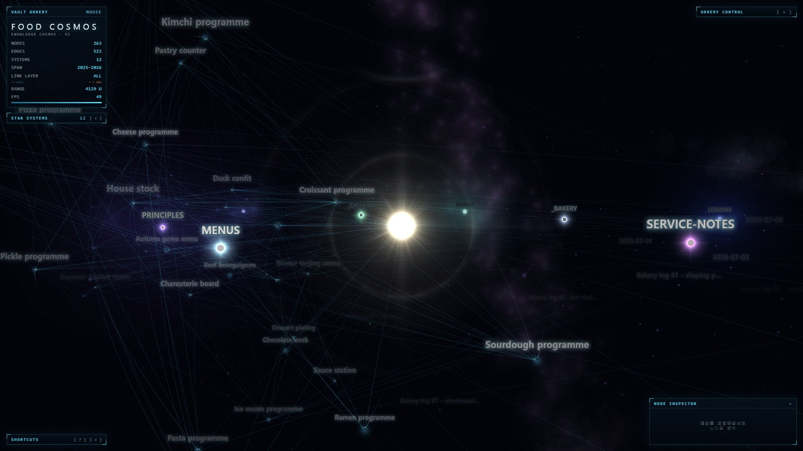
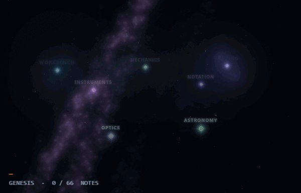
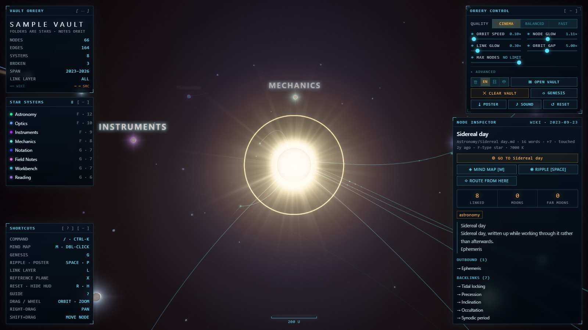
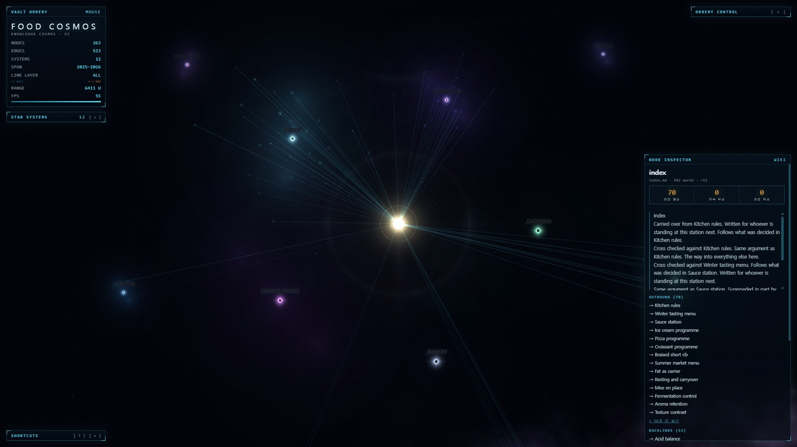

# Vault Orrery

**Your vault as a star system.** Folders become stars, notes orbit them, and a
Genesis timeline replays how the whole thing grew. Every body on screen is a
note you can be reading a second later. Runs entirely offline.

---

## Not another galaxy graph

Several plugins draw your vault as a starfield. If a prettier graph is all you
want, those are lighter and you should use one of them. This one is an
*orrery*, and three things follow from that:

**Folders are star systems, not another colour of dot.** Each folder is a lit
system sitting in its own gas, with its notes in orbit round its star. The
shape of the vault is the shape of the picture, so a crowded folder looks
crowded and an orphaned one sits out on its own.

**Genesis plays the vault's formation.** Press `G` and the cosmos rewinds to
void and condenses forward to today, note by note, in the order you actually
wrote them. Nothing else here does this, and it is not an animation of the
finished graph — it is the vault's own history, scrubbable.

<!-- GENESIS GIF — drop the file in and delete this comment:

-->

**It is wired into the editor.** Ctrl/Cmd-click a planet and the note opens
*beside* the orrery. The note you are editing carries its own beacon. *Show in
Vault Orrery* is on every note's context menu, and every mode is a command you
can bind a key to.

---

## What it does

- **Folders are stars, notes are planets, cited sources are moons.** Orbits
  open from a flat disc into a sphere on one knob.
- **Genesis** — `G` — plays the vault from void to present, with a scrubber.
- **Mind map** — `M` — one note's neighbourhood, two hops out, in place.
- **Search** — `/` — notes, controls and actions in one box.
- **Ripple** — `SPACE` — a wave along the links from the selected note.
- **Poster** — `P` — a high-resolution PNG of the cosmos with no HUD.
- **Ambient sound** — `U` — every note has a pitch; off until you ask.
- **한국어 · English · 日本語 · 中文**, switchable without reloading.

**The graph is Obsidian's own.** Links, backlinks and tags come from the index
Obsidian already keeps, so a link written through an alias resolves rather than
counting as broken, an embed counts as a link, and a `#tag` in a paragraph
counts alongside the ones in the front matter.

**The vault stays current.** Notes written, created, renamed or deleted while
the view is open re-derive the cosmos — camera and selection left where they
were, and no loading curtain over a view you are using.

---

## Controls

| | |
|---|---|
| `O` · ctrl/cmd-click | open the note in Obsidian |
| `/` | search |
| `M` · double-click | mind map |
| `G` | Genesis — play the vault's formation |
| `SPACE` | ripple from the selected note |
| `P` | save a poster (high-resolution PNG, no HUD) |
| `L` | cycle the link layer — ALL · WIKI · SOURCE · OFF |
| `X` | the reference plane on the layout's own plane |
| `U` | ambient sound |
| `R` · `H` | reset view · hide HUD |
| `?` | first-flight guide (also `[ ? ]` in the SHORTCUTS pane) |
| drag / wheel | orbit · zoom |
| right-drag · shift-drag | pan · move a node |

The first time a vault loads, a card names the four moves that are enough to
get going. Any key dismisses it; `?` brings it back.

---

## Privacy, in one paragraph

**No network access at runtime. At all.** No server, no telemetry, no
analytics, no update check, no remote font, no CDN — the plugin makes zero
outbound requests, and `npm run check` is that claim automated over the built
bundle. It reads every markdown file in the vault, because the shape of the
vault *is* what is being drawn and a graph of a subset is a different vault's
picture. Reading goes through Obsidian's own cache, and your excluded-files
patterns are applied first, so a note you have hidden is never opened at all.

→ [The long version, and how to verify it](docs/privacy.md)

---

## Large vaults

The **MAX NODES** ceiling ships **off**: a cap that silently drops half a vault
is worse than a slow first minute, and the slider is right there. If a big
vault runs slowly, turn **BLOOM** and the four **LIGHT** knobs off first, then
lower **LINK GLOW** and **STARFIELD**. Rendering stops entirely when you are
not looking at the view, so an orrery in a background tab costs nothing.

→ [Performance in detail](docs/performance.md)

---

## Installation

**From the community plugin browser:** Settings → Community plugins → Browse →
"Vault Orrery" → Install.

**Manually:** copy `main.js`, `manifest.json` and `styles.css` from the release
into `<vault>/.obsidian/plugins/vault-orrery/`, then enable it in Settings.
Those three files are the whole plugin — three.js is bundled into `main.js`, so
nothing is fetched at runtime.

Desktop only: the renderer needs WebGL.

---

## Going deeper

- [How the picture is made](docs/rendering.md) — the grade, the glow, and the
  two knobs that decide how tightly the cosmos is packed.
- [The astronomy is not decoration](docs/astronomy.md) — what is actually
  simulated, and what is deliberately not to scale.
- [The hub, and hearing the vault](docs/features.md) — how the central star is
  chosen, and what the sound is playing.
- [Privacy and excluded files](docs/privacy.md)
- [Performance on large vaults](docs/performance.md)
- [Development](docs/development.md) — the engine is a single openable HTML
  page; this is how it becomes the plugin.
- [Contributing](CONTRIBUTING.md)
- [Changelog](CHANGELOG.md)

---

## License

MIT — see [LICENSE](LICENSE).

This plugin bundles **three.js** (MIT) and nothing else, and does not fetch it
from a network at runtime. Full notice and licence text in
[THIRD-PARTY-NOTICES.md](THIRD-PARTY-NOTICES.md).
